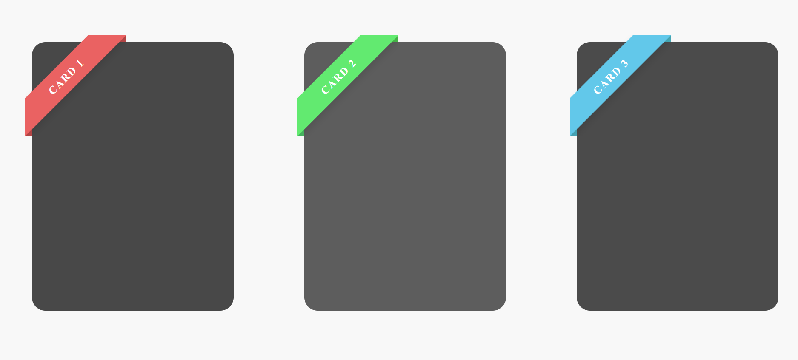
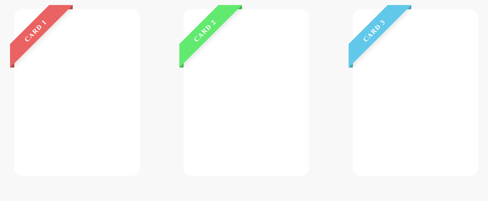

# **CINTAS**

Básicamente consiste en una cinta en la esquina superior izquierda para destacar ciertos productos de una tienda.

Está desarrollado con html y css:

| PORCENTAJE| x|
|---|---|
| HTML | 15 % |
| CSS | 58 % |

No es nada complicado. 👍
